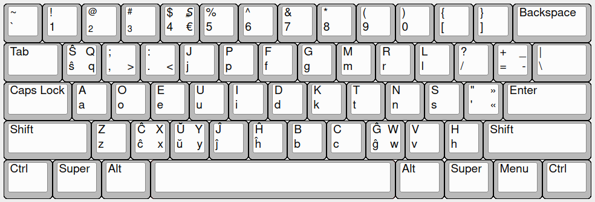

# Esperanta-Dvorako
Esperanta Dvoraka klavararanĝo por Linukso. Esperanto Dvorak key layout for linux.

*Ĉu vi amas Esperanton? Ĉu vi amas Dvorak-an klavararanĝon? Vi ne povas uzi ĝin kune? Mi havas solvon. Vi eĉ povas lerni ĝin per "Klavaro" aplikaĵo.*

### Kiel instali ĝin?
Por instali klavararanĝon vi devas elŝuti kaj movi [epodv](epodv) dosieron al `/usr/share/X11/xkb/symbols/` dosierujo. Se vi volas instali la klavararanĝon por la aplikaĵo "Klavaro" por lerni ĝin, vi devas elŝuti kaj movi dosieron [dvorak_eo.kbd](dvorak_eo.kbd) al `/usr/share/klavaro/` dosierujo.

### Kiel agordi ĝin?
Nuntempe vi devas uzi la komandon `setxkbmap epodv`, mi ankoraŭ ne scias kiel aldoni klavararanĝon al operaciuma klavararanĝa elektilo. Je "Klavaro" aplikaĵo vi devas elekti: Klavaro:>Esperantujo>dvorak.

Se vi volas plibonigi ĉi tiun projekton, ĵus krei "Issue"-on aŭ fari "Pull request"-on. Dankon al ĉiuj.
Mi bazis sur [ĉi tiu](https://lernu.net/en/forumo/temo/18360) ideo. 

### Ŝanĝprotokolo
02/07/21: Anstataŭigis `=` kun `-`

07/07/21: Ŝanĝis ĉiujn «KP» klavojn al numeraj.
