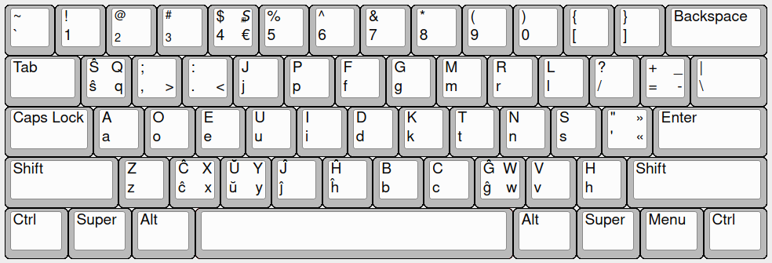

# Esperanta-Dvorako
Esperanta Dvoraka klavararanĝo por Linukso. Esperanto Dvorak key layout for linux.

*Ĉu vi amas Esperanton? Ĉu vi amas Dvorak-an klavararanĝon? Vi ne povas uzi ĝin kune? Mi havas solvon. Vi eĉ povas lerni ĝin per "Klavaro" aplikaĵo.*

### Kiel instali ĝin?

Por instali klavararanĝo vi devas elŝuti kaj movi [epodv] dosieron al `/usr/share/X11/xkb/symbols` dosierujo. Se vi volas instali la klavararanĝon por la programo "Klavaro" por lerni ĝin, vi devas elŝuti kaj movi dosieron [dvorak_eo.kbd] al `/usr/share/klavaro/` dosierujo.
